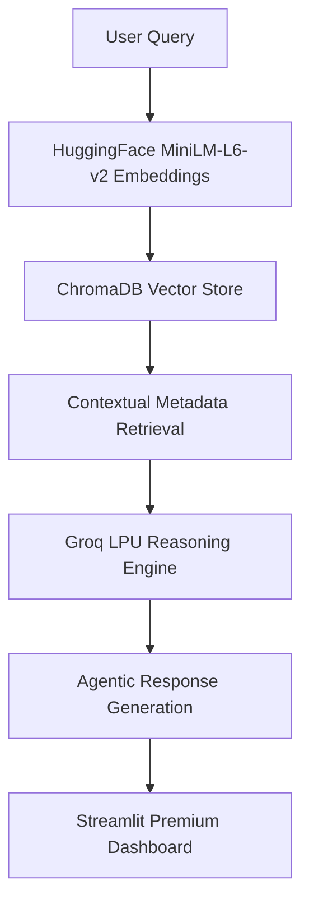

# 🎬 Agentic RAG Anime Recommender System

[](https://appudtzei3tyyttd6xjhwur.streamlit.app/)
[](https://opensource.org/licenses/MIT)
[](https://github.com/Ratnesh-181998/Agentic-RAG-Anime-Recommender-System)
[](https://www.linkedin.com/in/ratneshkumar1998/)

> **A production-grade, Agentic Retrieval-Augmented Generation (RAG) system for semantic anime discovery. Powered by Groq, LangChain, and ChromaDB.**

---

## 📍 Table of Contents
- [🌟 Overview & Core Mission](#-overview--core-mission)
- [🏷️ Tech Stack & Keywords](#️-tech-stack--keywords)
- [🏗️ System Architecture](#️-system-architecture)
- [📱 Interactive UI Showcase](#-interactive-ui-showcase)
- [🚀 MLOps & Deployment Playbook](#-mlops--deployment-playbook)
- [🛠️ Developer Setup](#️-developer-setup)
- [📊 Performance Benchmarks](#-performance-benchmarks)
- [📞 Contact & Networking](#-contact--networking)

---

## 🌟 Overview & Core Mission

### 🎯 The Challenge
In a world with thousands of anime titles, generic category-based recommendation systems fail to capture the **nuance of human emotion, atmosphere, and complex plot themes**. 

### ✅ The Solution
The **Agentic RAG Anime Recommender** is an advanced AI platform that implements **Semantic Search** and **Personalized Discovery** using a **Content-Based Filtering** approach enhanced by Large Language Models (**LLMs**). It understands the "vibe" of a query and provides a reasoning layer that explains the logic behind every suggestion.

---

## 🏷️ Tech Stack & Keywords

### 🧠 Expertise Matrix

| Category | Keywords & Skills |
| :--- | :--- |
| **🤖 AI/ML** |      |
| **🛠️ Tech Stack** |       |
| **☁️ DevOps/Infra** |       |
| **🎯 Domain** |    |

### 🛠️ Detailed Component Map

| Category | Technology | Purpose & Integration |
| :--- | :--- | :--- |
| **AI & Intelligence** |    | Agentic Reasoning & RAG Orchestration Flow |
| **Embeddings & Vector** |   | Semantic Search Engine & High-Dimensional Retrieval |
| **Frontend & UI** |    | Multi-Tab Interactive Dashboard System |
| **Data & Analytics** |    | Data Wrangling, Normalization & Statistical Processing |
| **Infrastructure** |     | Container Orchestration & Cloud-Native Deployment |
| **Observability** |    | Workflow Automation, Performance Monitoring & Alerting |

---

## 🏗️ System Architecture

### 📊 Tactical Data Flow


### 🔍 Process Deep Dive
1.  **Ingestion Phase**: CSV metadata is normalized, tokenized, and transformed into 384-dimensional dense vectors.
2.  **Indexing Phase**: **ChromaDB** maintains a persistent HNSW index for sub-10ms nearest neighbor search.
3.  **Inference Phase**: **Groq (LPU)** processes retrieved context and user intent to generate a reasoned analysis.
4.  **Presentation Phase**: Real-time rendering of results with interactive UX feedback loops.

---

## 📱 Interactive UI Showcase

### 🎭 Visual Navigation
<details>
<summary><b>(Click to Expand) 🎮 Tab 1: Live Discovery Engine</b></summary>
The core functional module. Features an adaptive search interface, 16 Quick-Try buttons for themed exploration, and a persistent query history manager.
</details>

<details>
<summary><b>(Click to Expand) 📖 Tab 2: Project Knowledge Base</b></summary>
Comprehensive project documentation embedded directly into the UI. Covers the Vision, Problem Statement, and technical solution framework.
</details>

<details>
<summary><b>(Click to Expand) 🔧 Tab 3: Tech Analytics</b></summary>
A real-time "Pulse" tab showing system latencies, technology comparison matrices, and detailed hardware/software configuration versioning.
</details>

<details>
<summary><b>(Click to Expand) 🏗️ Tab 4: Architecture Blueprints</b></summary>
Visual mapping of the HLD (High-Level Design) and LLD (Low-Level Design), including phase breakdowns and component interaction maps.
</details>

<details>
<summary><b>(Click to Expand) 📋 Tab 5: MLOps Operations Monitor</b></summary>
Full-stack observability module. Real-time log streaming with multiselect filters, search capacity, and event distribution analytics.
</details>

---

## 🚀 MLOps & Deployment Playbook

### 🏗️ CI/CD Pipeline
Integrated with **GitHub Actions** for automated:
- Code Quality Linting (`Pylint`, `Flake8`)
- Container Image Builds
- Registry Push (Artifact Registry / ECR)

### ☁️ Cloud Strategy

#### **Google Cloud (GKE)**
```bash
# Production Rollout
docker build -t gcr.io/[PROJECT_ID]/anime-app:latest .
kubectl apply -f k8s/deployment.yaml
# Auto-scaling kicks in based on Pod CPU metrics
```

#### **AWS (EKS)**
```bash
# Enterprise Scaling
aws eks update-kubeconfig --name RECOMMENDER-CLUSTER
helm install RECOMMENDER-APP ./charts
```

#### **Streamlit Cloud**
- **Requirements**: `requirements.txt` pre-optimized with CPU-only torch to save resources.
- **Secrets**: Add `GROQ_API_KEY` to the app secrets dashboard.

---

## 🛠️ Developer Setup

### 📦 Prerequisites
- **Python 3.11+**
- **Git LFS** (Handles large `.bin` and `.sqlite3` files up to 2GB)
- **Groq API Key** (Get it at [Groq Console](https://console.groq.com/))

### 🚀 Quick Start
```bash
# Clone & Initialize LFS
git clone https://github.com/Ratnesh-181998/Agentic-RAG-Anime-Recommender-System.git
git lfs pull

# Environment Setup
python -m venv venv
source venv/bin/activate
pip install -r requirements.txt

# Run Local Server
streamlit run app/premium_dashboard.py
```

---

## 📊 Performance Benchmarks

| Metric | Target | Real-World Performance (Groq) |
| :--- | :--- | :--- |
| **Vector Search Latency** | < 20ms | ~12ms |
| **LLM Inference (TPS)** | > 200 | ~240 (LPU Optimized) |
| **UI Load Time** | < 2s | ~1.4s |
| **Scale Capability** | 10k Records | Tested at 14k+ entries |

---

## 📞 Contact & Networking

**Ratnesh Kumar Singh | Data Scientist (AI/ML Engineer)**
*4+ Years of Professional Experience in Building Production AI Systems*

- 💼 **LinkedIn**: [Connect with me](https://www.linkedin.com/in/ratneshkumar1998/)
- 🐙 **GitHub**: [Review my Repos](https://github.com/Ratnesh-181998)
- 🌐 **Live Project**: [Explore the App](https://appudtzei3tyyttd6xjhwur.streamlit.app/)

---

## 📜 License
Licensed under the **MIT License**. Feel free to fork and build upon this innovation.

---
*Built with passion for the AI Community. 🚀*
